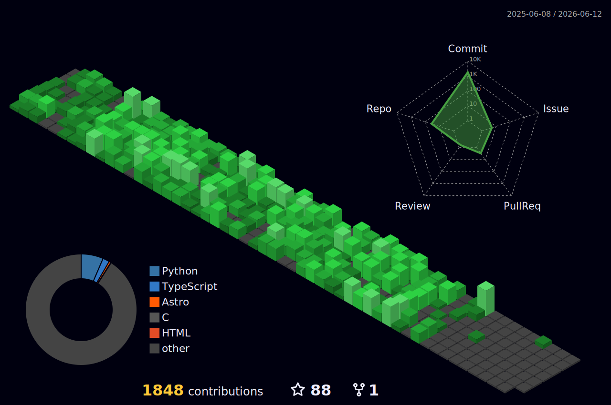

## This is me 💁

#### Hello everyone,my name is RealTapeL. I'm a computer student at a university. I have been learning c language and robot programming since I was very young. Currently, my research directions are visual tasks, data processing and large models. My hobbies are embedded systems, such as Raspberry PI and Jetson. I like to automate my life. I like buying good-looking products, clothes and food. Suffering from congenital heart disease and severe depression, sometimes one may not be optimistic. Hopefully, it will get better in the future.This is my personal blog:https://blog-1og9.vercel.app/

## My technology stack

