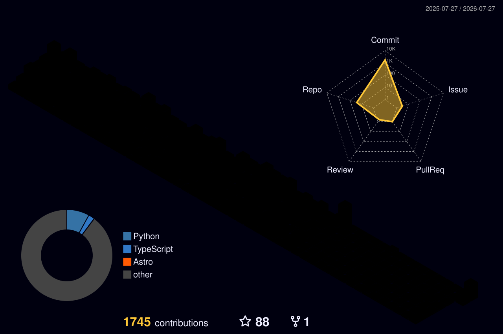

  

  
  

## About me

Computer science student working on **vision AI**, **AI agents**, data automation, and edge computing with Raspberry Pi and Jetson.

## Tech stack

  

## Selected work

- [BrandPulse](https://github.com/RealTapeL/BrandPulse) — an agent system for brand intelligence
- [Xiao_i_Chat](https://github.com/RealTapeL/Xiao_i_Chat) — large-language-model work for vocational education
- [AnomalyDINO](https://github.com/RealTapeL/AnomalyDINO) — few-shot visual anomaly detection with DINOv2

## GitHub stats

  <picture>
    <source media="(prefers-color-scheme: dark)" srcset="https://github-readme-stats.vercel.app/api?username=RealTapeL&show_icons=true&hide_border=true&title_color=60A5FA&icon_color=FB7185&text_color=E2E8F0&bg_color=0D1117" />
    
  </picture>
  <picture>
    <source media="(prefers-color-scheme: dark)" srcset="https://streak-stats.demolab.com?user=RealTapeL&hide_border=true&background=0D1117&ring=60A5FA&fire=FB7185&currStreakNum=E2E8F0&sideNums=E2E8F0&currStreakLabel=60A5FA&sideLabels=94A3B8&dates=94A3B8&stroke=1E3A8A" />
    
  </picture>

## 3D contributions

  

## Contribution snake

  <picture>
    <source media="(prefers-color-scheme: dark)" srcset="./assets/github-contribution-snake-dark.svg" />
    
  </picture>

